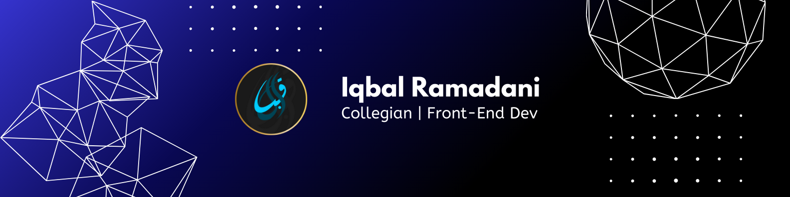

##### 💻 Skills
     

##### 🌐 Connect with me
 

##### 📊 GitHub Stats:
 
 

##### 🔝 Top Contributed Repo

---

<!-- <picture>
  <source media="(prefers-color-scheme: dark)" srcset="https://raw.githubusercontent.com/IqbalRamadani/IqbalRamadani/output/pacman-contribution-graph-dark.svg">
  <source media="(prefers-color-scheme: light)" srcset="https://raw.githubusercontent.com/IqbalRamadani/IqbalRamadani/output/pacman-contribution-graph.svg">
  
</picture> -->

###

<!---
IqbalRamadani/IqbalRamadani is a ✨ special ✨ repository because its `README.md` (this file) appears on your GitHub profile.
You can click the Preview link to take a look at your changes.
--->
